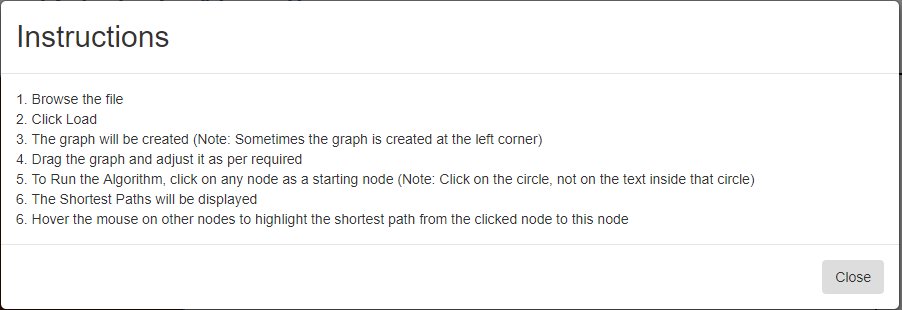
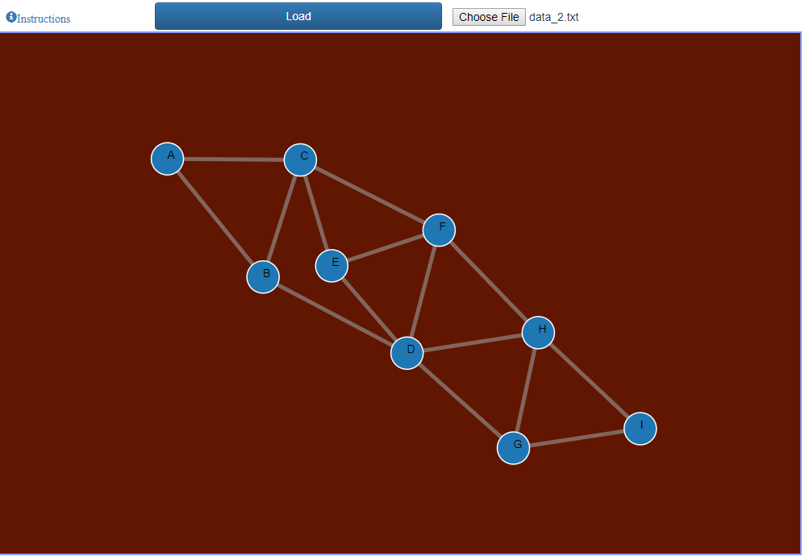
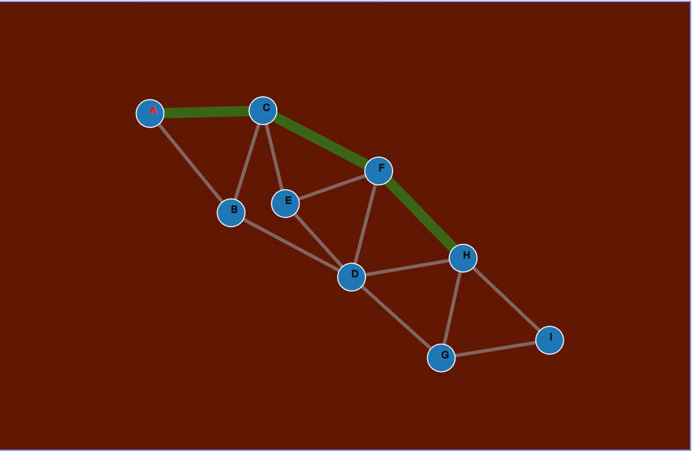
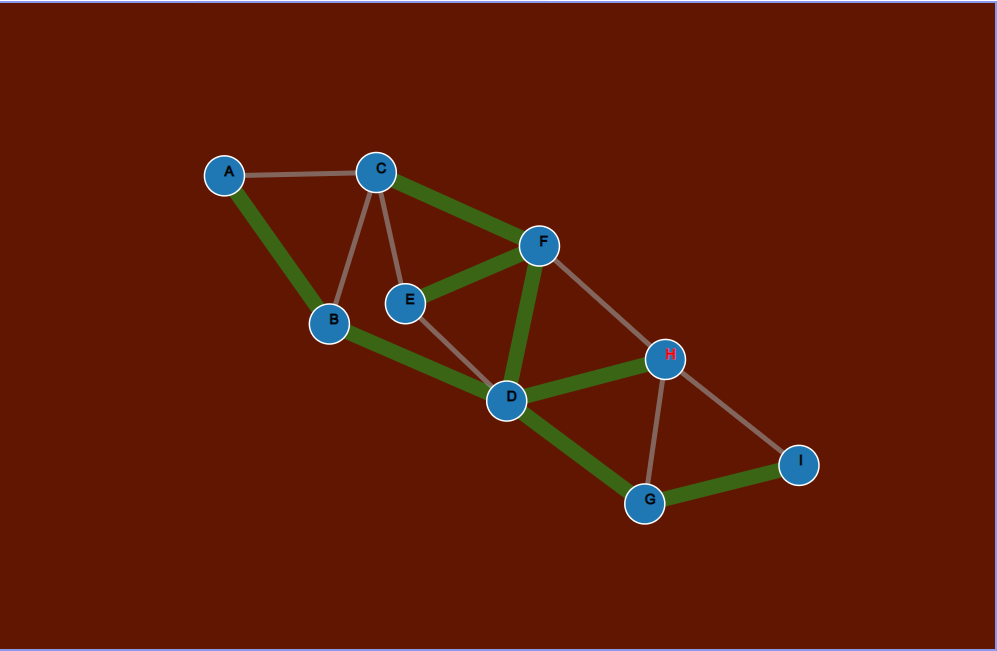

## Algorithms and Data Structures

# Data Structures
1. My Queue
2. My Stack

# Sorting Algorithms
1. Insertion Sort
2. Heap In Place Sort
3. Merge Sort
4. Quick Sort: -
    * Pivot selected at first position
    * Pivot selected at middle position
    * Pivot selected at random position
    * With insertion sort for small partition

# Intelligent Algorithms
1. A-star algorithm for 8-Puzzle problem
    * Heuristic = Number of misplaced tiles
    * Heuristic = Manhattan Distance
2. Hill Climbing to solve N-Queens problem
    * Steepest Ascent
    * Hill Climbing with sideways move
    * Random Restart Hill Climbing search

# Graph Algorithms
1. Dijkstra Algorithm for shortest path
2. Prim's Algorithm for minimum Spanning tree

